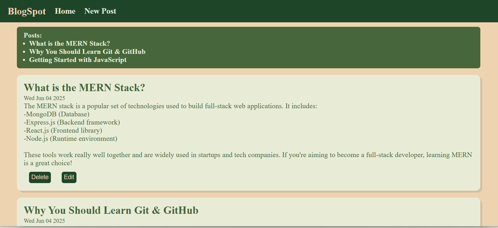
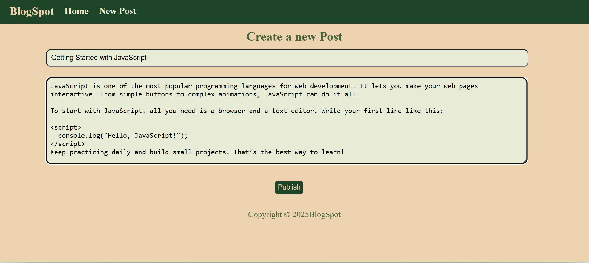
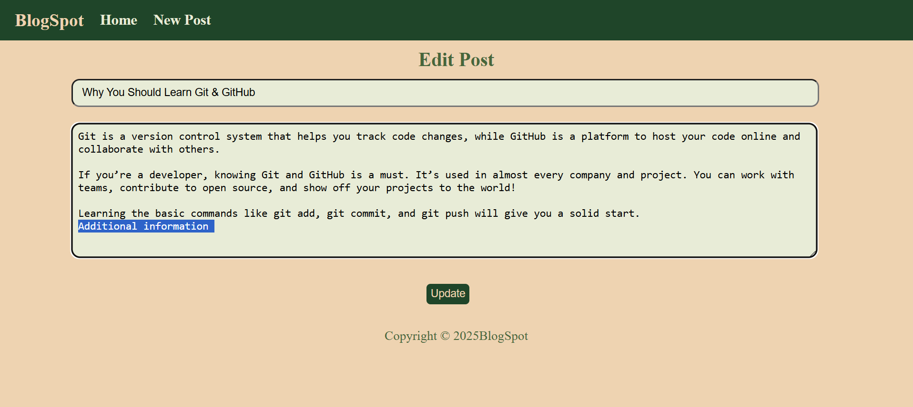

# BlogCraft 📝

A simple blogging app using Node.js, Express, EJS, and PostgreSQL. Users can create, edit, and delete blog posts.

## Features

- Create, update, delete posts
- PostgreSQL for database
- EJS for templating

## Technologies

- Node.js + Express
- PostgreSQL
- EJS + HTML/CSS
## Screenshots

### Home Page
 

### Create Post Page
 
### Edit Post Page 
 

## How to Run

1. Clone the repo
2. Run `npm install`
3. Create `posts` table in PostgreSQL:
   ```sql
   CREATE TABLE posts (
     id SERIAL PRIMARY KEY,
     title TEXT NOT NULL,
     content TEXT NOT NULL,
     date TEXT
   );
   ```
4. Create a `.env` file with your DB credentials
5. Run `node index.js` and go to `http://localhost:3000`

---

Made by Mythili ❤️
